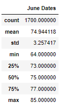
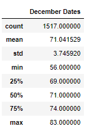

# surfs_up
## Overview
Before opening the Surf shop, we would like to all the data for the months of June and December in Oahu to determine if the surf and ice cream shop business is sustainable year-round
## Results
The summary statistics for the months of June and December are listed below

  
### June vs December comparison 
* There are a few more data points for June than there are in December
* December and June both have very similar average temperatures, with December at 71 degrees and June at 74.9 degrees
* The max temperatures for both months are also very close with December at 83 degrees and June at 85
* The minimum temperatures are the most different with December at 56 and June at 64

## Summary
Overall, the temperatures in June and December are very similar therefore it appears that Oahu might be a great place to have an ice cream and surf shop as it will be warm year-round. 

However there are other things I would investigate before making a final decision. 
* how often is the ocean ideal for surfing, it could be warm on average year-round but if surfing is not good then it would be a bad idea to open a surf shop. 
* I would also look to see if there is a rainy season or monsoon season that would impact surfing during certain times of the year.
* location on the island of Oahu itself -  Different areas around Oahu may have different conditions so I would compare data between the individual stations to find the best location on the island
